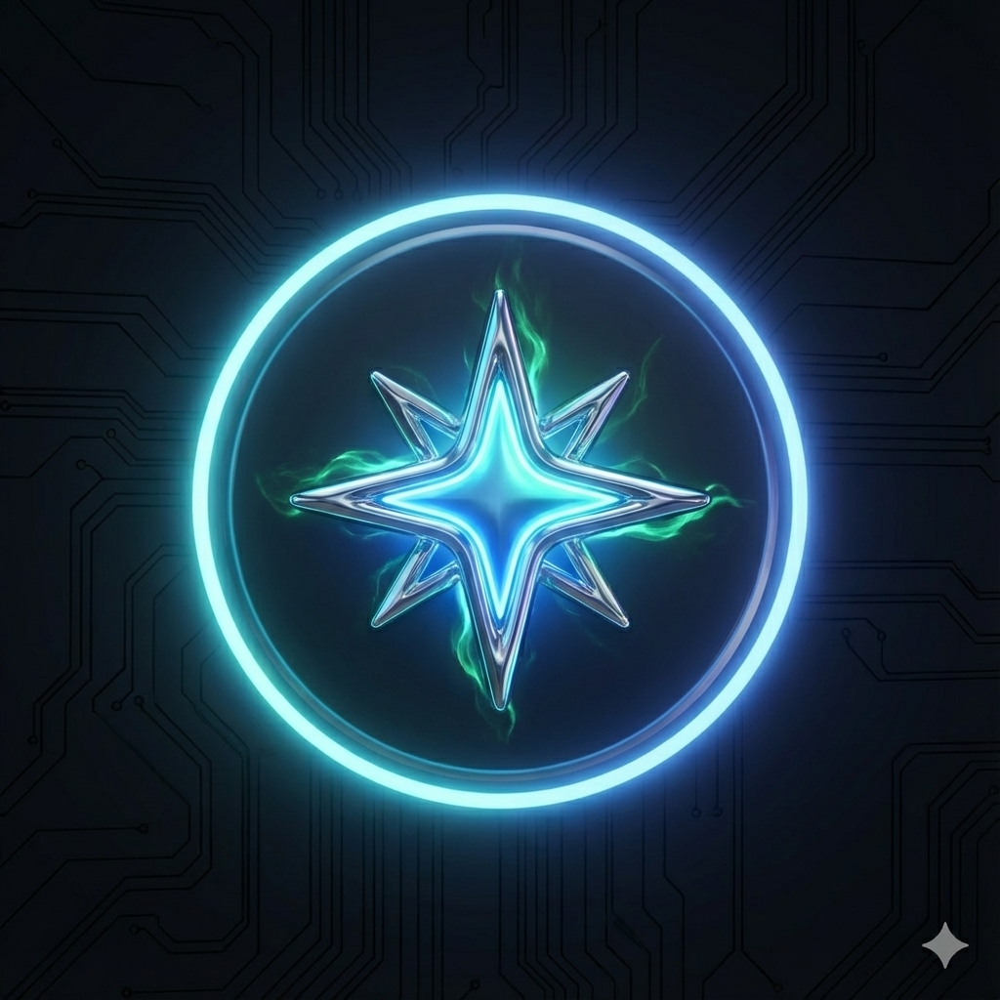

# E-coma - E-commerce Administrator

<div align="center">



**Your All-in-One E-Commerce & Digital Marketing Platform for Algeria**

[](https://nextjs.org/)
[](https://www.typescriptlang.org/)
[](https://tailwindcss.com/)
[](https://supabase.com/)
[](LICENSE)

</div>

---

## 📋 Table of Contents

- [Overview](#-overview)
- [Key Features](#-key-features)
- [Tech Stack](#-tech-stack)
- [Quick Start](#-quick-start)
- [Project Structure](#-project-structure)
- [Documentation](#-documentation)
- [Screenshots](#-screenshots)
- [Contributing](#-contributing)
- [License](#-license)

---

## 🌟 Overview

**E-coma** is a comprehensive SaaS platform designed specifically for Algerian e-commerce businesses, digital marketers, and entrepreneurs. It combines powerful business analytics, inventory management, social media automation, advertising optimization, and AI-powered tools into a single, unified workspace.

### Why E-coma?

- 🇩🇿 **Built for Algeria**: Localized for Algerian market with Wilaya-based analytics, COD tracking, and Darja support
- 🤖 **AI-Powered**: Leverages Google Gemini for content generation, risk scoring, and optimization
- 📊 **Data-Driven**: Comprehensive analytics with ROAS tracking, profit calculators, and regional insights
- 🚀 **All-in-One**: Replaces 10+ separate tools with unified workspace
- 💰 **Cost-Effective**: Flexible subscription tiers with pay-per-use AI credits

### Who Is It For?

- **E-commerce Merchants** (Tajers) - Manage inventory, orders, and delivery operations
- **Digital Marketers** - Run campaigns, create content, and optimize ad spend
- **Social Media Managers** - Schedule posts, engage audiences, and analyze performance
- **Dropshippers** - Research winning products, manage suppliers, and track trends
- **Agencies** - Manage multiple client accounts and advertising budgets

---

## ✨ Key Features

### 📈 Business Analytics

- Real-time dashboard with key performance indicators (KPIs)
- Revenue, profit, and cost analysis with interactive charts
- Customer lifecycle funnels and conversion tracking
- Traffic analytics with source attribution
- 58 Wilaya heatmap visualization for regional insights
- Top products and landing pages reports

### 🛒 E-Commerce Operations

- **Order Management**: Full confirmation workflow (SMS → Call → GPS collection)
- **Inventory Control**: Multi-location stock tracking with low stock alerts
- **Smart Delivery**: Integration with Yalidine, Maystro, NordEst carriers
- **COD Cash Tracking**: Track cash on delivery payments
- **Return Risk Calculator**: AI-powered prediction to reduce 40% return rates
- **Customer Blacklist**: Fraud prevention system
- **Offer Management**: Create and manage discounts/promotions

### 🔍 Product Research Studio

- Trending products discovery with AI scoring (0-10 scale)
- Competitor tracking and analysis
- Product search by name, photo, or URL
- Social media topic monitoring
- Algeria-specific trend analysis
- China import service with budget tracking

### 📱 Social Media Management

- **AI Content Creator**: Generate captions, hooks, and articles with Gemini
- **Media Studio**: Edit photos and videos with built-in tools
- **Darja Optimizer**: Optimize content for Algerian Arabic dialect
- **Smart Scheduler**: Calendar-based publishing with intelligent queue
- **Multi-Platform**: Publish to Instagram, Facebook, TikTok, LinkedIn
- **Comments Automation**: Auto-moderation and AI-powered responses
- **Inbox Management**: Unified conversation inbox

### 🎯 Advertising & Marketing

- **Ad Manager**: Create and manage Meta/TikTok ads at scale
- **Bulk Creation**: Generate multiple ad variations automatically
- **ROAS Analyzer**: Real-time return on ad spend tracking with smart stop-loss
- **Creative Insights**: Analyze top-performing ad creatives
- **Dark Posting**: Create ads without appearing on business page
- **Budget Optimizer**: AI-powered budget allocation recommendations
- **Landing Page Builder**: Create high-converting landing pages
- **Influencer Marketplace**: Find and pay influencers for promotions

### 🤖 AI Agents (Ecosystem Modules)

- **DM Sales Agent**: Automated sales conversations in Messenger/WhatsApp
- **DM Support Agent**: 24/7 customer support automation
- **Comment Response Agent**: Auto-reply to comments with context awareness
- **Content Generator**: Create posts, captions, and articles with AI

### 🎨 Advanced Content Creation

- **Hook Generator**: Create attention-grabbing opening lines
- **Hook Analyzer**: Score and improve your hooks (0-10 scale)
- **TikTok Monetization Wizard**: Optimize for TikTok Creator Fund
- **Content Safety Checker**: Ensure brand-safe content
- **Brand Voice Profile**: Maintain consistent brand tone
- **Quality Optimizer**: Improve content quality scores
- **Format Presets**: One-click formatting for different platforms

### 💼 Admin & Settings

- **Brand Kit**: Manage colors, fonts, logos, and brand assets
- **Brand Voice**: Define brand personality and tone guidelines
- **Team Management**: Invite team members with role-based access
- **Credit Balance**: Track AI credits and top-up requests
- **Help Center**: Searchable knowledge base with AI assistant
- **Billing**: Manage subscriptions and payment methods

---

## 🛠️ Tech Stack

### Frontend

- **Framework**: [Next.js 15](https://nextjs.org/) (React 18.3, App Router)
- **Language**: [TypeScript 5](https://www.typescriptlang.org/)
- **Styling**: [Tailwind CSS 3.4](https://tailwindcss.com/) + [shadcn/ui](https://ui.shadcn.com/)
- **UI Components**: [Radix UI](https://www.radix-ui.com/) (Accessible, unstyled primitives)
- **Modal System**: Unified [Dialog, Sheet, Command Palette] patterns
- **Animations**: [Framer Motion 12](https://www.framer.com/motion/)
- **Charts**: [Recharts 3.5](https://recharts.org/)
- **Forms**: React Hook Form + [Zod](https://zod.dev/) validation
- **Date Handling**: [date-fns 3.6](https://date-fns.org/)

### Backend & Database

- **Database**: [Supabase](https://supabase.com/) (PostgreSQL)
- **Authentication**: Supabase Auth (Email, OAuth)
- **Storage**: Supabase Storage for media files
- **Real-time**: Supabase Realtime subscriptions
- **SSR**: Supabase SSR for Next.js App Router

### AI & APIs

- **AI Model**: [Google Gemini 1.5 Flash](https://ai.google.dev/)
- **Content Generation**: AI-powered copywriting, hooks, descriptions
- **Risk Scoring**: Predictive analytics for returns and engagement
- **Optimization**: ROAS optimization, budget allocation

### State Management

- **Global State**: [Zustand 4.5](https://zustand-demo.pmnd.rs/)
- **Context API**: React Context for layout, scroll, panels
- **Server State**: TanStack Query 5.0 (React Query)

### Additional Tools

- **Drag & Drop**: [@dnd-kit](https://dndkit.com/)
- **Notifications**: [Sonner](https://sonner.emilkowal.ski/)
- **Icons**: [Lucide React](https://lucide.dev/)
- **QR Codes**: [qrcode.react](https://github.com/zpao/qrcode.react)
- **Algerian Maps**: [algeria-map-ts](https://www.npmjs.com/package/algeria-map-ts)

---

## 🚀 Quick Start

### Prerequisites

- **Node.js**: 18.x or higher
- **npm**: 9.x or higher (or yarn/pnpm)
- **Supabase Account**: [Create free account](https://supabase.com/)
- **Google AI API Key**: [Get API key](https://ai.google.dev/)

### Installation

1. **Clone the repository**

   ```bash
   git clone https://github.com/yourusername/e-coma.git
   cd e-coma
   ```

2. **Install dependencies**

   ```bash
   npm install
   ```

3. **Set up environment variables**

   ```bash
   cp .env.example .env.local
   ```

   Edit `.env.local` with your credentials:

   ```env
   NEXT_PUBLIC_SUPABASE_URL=your_supabase_project_url
   NEXT_PUBLIC_SUPABASE_ANON_KEY=your_supabase_anon_key
   GEMINI_API_KEY=your_google_ai_api_key
   ```

4. **Set up Supabase database**
   - Create a new Supabase project
   - Run the migration files in `supabase/migrations/`
   - Or use Supabase CLI:

     ```bash
     npx supabase db push
     ```

5. **Run development server**

   ```bash
   npm run dev
   ```

6. **Open your browser**
   Navigate to [http://localhost:3000](http://localhost:3000)

### Build for Production

```bash
npm run build
npm start
```

---

## 📁 Project Structure

```
e-coma/
├── public/                      # Static assets
│   ├── assets/                 # Feature icons and images
│   └── images/                 # Background textures
├── src/
│   ├── app/                    # Next.js App Router pages
│   │   ├── (hub)/             # Main dashboard
│   │   ├── analytics/         # Business analytics
│   │   ├── stock/             # Inventory management
│   │   ├── sales-dashboard/   # Order management
│   │   ├── creatives/         # Content creation
│   │   ├── ads/               # Ad management
│   │   ├── marketing/         # Marketing automation
│   │   ├── product-research/  # Market research
│   │   ├── social/            # Social media tools
│   │   ├── admin/             # Admin settings
│   │   ├── auth/              # Authentication
│   │   └── api/               # API routes
│   │       ├── agents/        # AI agent endpoints
│   │       ├── credits/       # Credit system
│   │       ├── marketing/     # Marketing API
│   │       └── products/      # Product API
│   ├── components/             # React components
│   │   ├── core/              # Core system components
│   │   │   ├── layout/        # Layout components (14 files)
│   │   │   ├── ui/            # UI primitives (73 files)
│   │   │   └── providers/     # Context providers
│   │   ├── analytics/         # Analytics components
│   │   ├── marketing/         # Marketing components
│   │   ├── social/            # Social media components
│   │   ├── store/             # E-commerce components
│   │   ├── admin/             # Admin components
│   │   └── shared/            # Shared utilities
│   ├── config/                 # Configuration files
│   │   ├── ecosystem-config.ts      # Bottom bar modules
│   │   ├── navigation.tsx           # Main navigation
│   │   ├── hub-config.ts            # Hub categories
│   │   ├── feature-favorites-config.ts  # 127 features
│   │   └── rightPanelConfig.tsx     # Right panel config
│   ├── lib/                    # Utility libraries
│   │   ├── supabase/          # Supabase clients
│   │   ├── gemini.ts          # Google AI integration
│   │   ├── utils.ts           # Helper functions
│   │   └── mock-data.ts       # Mock data for demo
│   ├── hooks/                  # Custom React hooks
│   └── utils/                  # Utility functions
├── supabase/
│   └── migrations/            # Database migrations
├── docs/                       # Documentation
├── .env.example               # Environment variables template
├── next.config.ts             # Next.js configuration
├── tailwind.config.ts         # Tailwind CSS configuration
├── tsconfig.json              # TypeScript configuration
└── package.json               # Dependencies
```

### Key Directories

- **`src/app/`**: Next.js 15 App Router with file-based routing
- **`src/components/core/layout/`**: Advanced layout system with context providers
- **`src/components/core/ui/`**: 69 reusable UI components (shadcn/ui based)
- **`src/config/`**: Centralized configuration for navigation, features, and modules
- **`src/lib/`**: Core utilities and third-party integrations

---

## 📚 Documentation

Comprehensive documentation is available in the `docs/` folder:

- **[Setup Guide](docs/SETUP.md)** - Detailed installation and configuration
- **[Architecture](docs/ARCHITECTURE.md)** - System design and patterns
- **[API Reference](docs/API.md)** - API endpoints and usage
- **[Components](docs/COMPONENTS.md)** - Component library documentation
- **[Database Schema](docs/DATABASE.md)** - Database tables and relationships
- **[Features Guide](docs/FEATURES.md)** - All 127 features explained
- **[Environment Variables](docs/ENVIRONMENT.md)** - Configuration options
- **[Deployment](docs/DEPLOYMENT.md)** - Production deployment guide
- **[Contributing](docs/CONTRIBUTING.md)** - Contribution guidelines

---

## 🎨 Screenshots

### Dashboard


*Real-time business analytics with KPI cards and revenue charts*

### Product Research


*Discover trending products with AI scoring and competitor analysis*

### Social Media Studio


*Create, schedule, and publish content across multiple platforms*

### Ad Manager


*Manage advertising campaigns with ROAS tracking and optimization*

---

## 🌍 Algerian Market Features

### Geographic Data

- **58 Wilayas** (provinces) with heatmap visualization
- **1,541 Communes** (municipalities) for precise addressing
- **Regional Zones**: Center, East, West, South for delivery pricing

### Business Localization

- **COD-First**: ~90% of transactions are cash on delivery
- **Return Rate Optimization**: AI predicts and prevents high return rates (~40%)
- **Delivery Integration**: Yalidine, Maystro, NordEst APIs
- **Tax Compliance**: IFU calculator for legal requirements
- **Language Support**: Arabic, French, English, and Darja (Algerian dialect)

### Payment Methods

- Cash on Delivery (COD)
- Baridimob (Algeria Post mobile payment)
- Bank transfers
- Credit card (CIB)

---

## 🤝 Contributing

We welcome contributions from the community! Please read our [Contributing Guide](docs/CONTRIBUTING.md) for details on:

- Code of Conduct
- Development workflow
- Coding standards
- Commit conventions
- Pull request process
- Testing requirements

### Development

```bash
# Run development server
npm run dev

# Type checking
npx tsc --noEmit

# Linting
npm run lint

# Build for production
npm run build
```

---

## 🐛 Known Issues & Roadmap

### Current Limitations

- ⚠️ API routes return mock data (backend integration in progress)
- ⚠️ Authentication flow needs completion
- ⚠️ Build warnings for TypeScript errors (temporarily ignored)

### Roadmap

- [ ] Real-time collaboration features
- [ ] Mobile app (React Native)
- [ ] WhatsApp Business API integration
- [ ] Advanced AI agents with conversation history
- [ ] Multi-currency support
- [ ] Export/import data capabilities
- [ ] Custom report builder
- [ ] Webhook integrations
- [ ] API for third-party developers

---

## 📄 License

This project is proprietary software. All rights reserved.

For licensing inquiries, please contact: [your-email@example.com](mailto:your-email@example.com)

---

## 💬 Support

- **Documentation**: [docs/](docs/)
- **Issues**: [GitHub Issues](https://github.com/yourusername/e-coma/issues)
- **Email**: <support@e-coma.com>
- **WhatsApp**: +213 XXX XXX XXX

---

## 🙏 Acknowledgments

- [Next.js](https://nextjs.org/) - The React framework
- [Supabase](https://supabase.com/) - Backend as a service
- [shadcn/ui](https://ui.shadcn.com/) - Beautiful UI components
- [Radix UI](https://www.radix-ui.com/) - Accessible primitives
- [Vercel](https://vercel.com/) - Hosting and deployment
- [Google AI](https://ai.google.dev/) - Gemini AI model

---

<div align="center">

**Built with ❤️ for Algerian entrepreneurs**

[Website](https://e-coma.com) • [Twitter](https://twitter.com/ecoma) • [LinkedIn](https://linkedin.com/company/e-coma)

</div>
