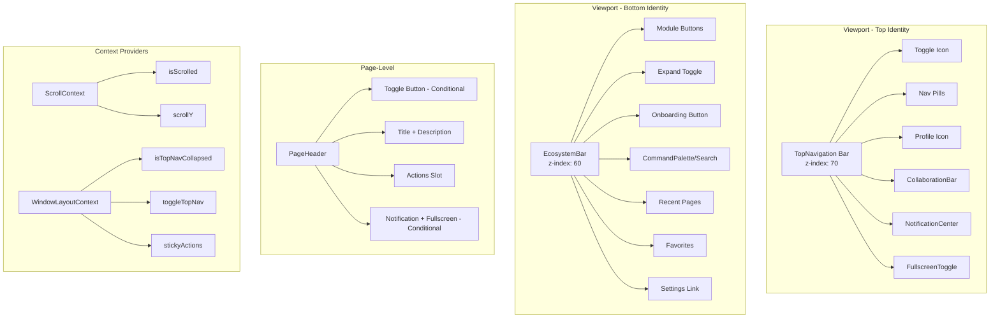
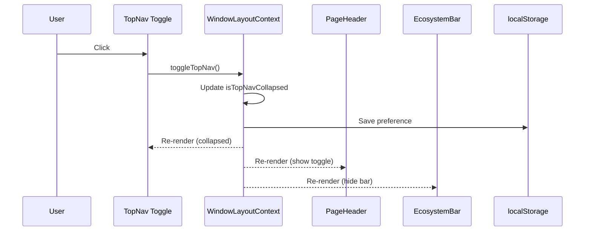
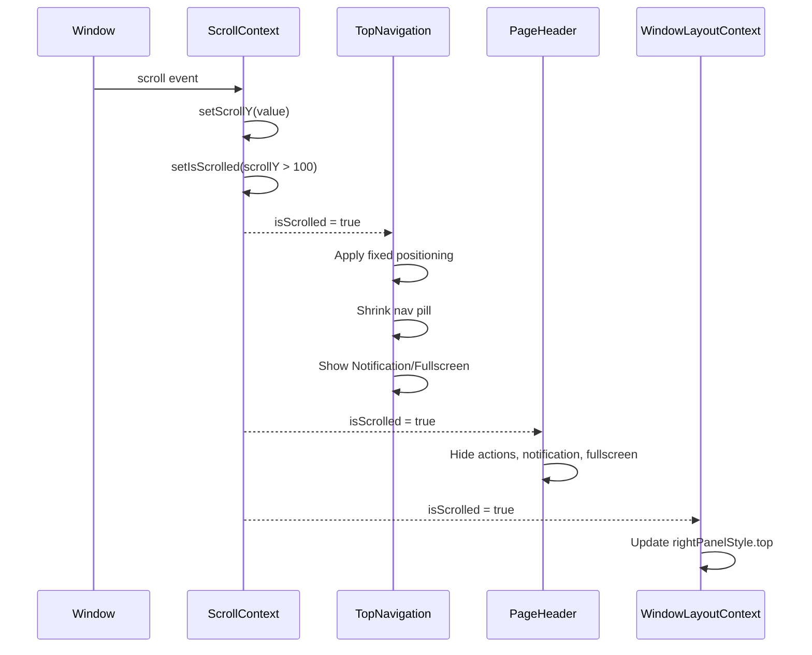

# Global UI Relation Analytics

> **Document Purpose:** Analyze the relationships, scroll behaviors, and placement of all global UI elements in the viewport's "Top Identity" zone.

---

## 1. Global UI Element Hierarchy



---

## 2. UI Elements Master Table

### 2.1 Top Navigation Bar Elements

| Element | Component | Location | Z-Index | Visibility Condition | Scroll Behavior | Parent Relationship |
|---------|-----------|----------|---------|---------------------|-----------------|---------------------|
| **Toggle Icon** | `TopNavigation.tsx:60-71` | Left of Nav Pill | 70 | **Always visible** | Translates right when collapsed + scrolled | Sibling to Nav Pill |
| **Nav Pills** | `TopNavigation.tsx:74-141` | Center-left | 70 | `!isTopNavCollapsed` | Width shrinks, labels hide (except active), H: 14→9 | Contains nav items |
| **Profile Icon** | `ProfileMenu` via `TopNavigation.tsx:152-161` | Right side of Nav Pill | 70 | Always visible when nav visible | Size shrinks: `w-7 h-7` when scrolled | Sibling to CollaborationBar |
| **CollaborationBar** | `CollaborationBar.tsx` via `TopNavigation.tsx:145` | Right of divider, left of Profile | 70 | `compact` mode when scrolled, `hidden sm:flex` | **Compact mode on scroll (smaller avatars)** | Sibling to Profile |
| **NotificationCenter** | `notification-center.tsx` via `TopNavigation.tsx:148` | Inside nav pill right section | 70 | **Always visible** | Static (no longer conditional) | Sibling to Fullscreen |
| **FullscreenToggle** | `fullscreen-toggle.tsx` via `TopNavigation.tsx:149` | Right of Notification | 70 | **Always visible** + `hidden md:flex` | Desktop only, static | Sibling to Notification |

### 2.2 EcoSystem Bar Elements (Bottom Bar)

| Element | Component | Location | Z-Index | Visibility Condition | Scroll Behavior | Parent Relationship |
|---------|-----------|----------|---------|---------------------|-----------------|---------------------|
| **Module Buttons** | `EcosystemBar.tsx:165-218` | Left section | 60 | `!isTopNavCollapsed` | Static (bar hides entirely) | Container for module status |
| **Expand Toggle** | `EcosystemBar.tsx:239-254` | After modules | 60 | Always in bar | Triggers panel expand | Sibling to modules |
| **Onboarding Button** | `EcosystemBar.tsx:264-282` | Center-right | 60 | Always | Opens modal popup | Sibling to search |
| **CommandPalette** | `command-palette.tsx` via `EcosystemBar.tsx:409` | Center-right | 60 | `md:flex` | Desktop only | Sibling to onboarding |
| **Recent Pages** | `EcosystemBar.tsx:419-488` | Right section | 60 | `recentPages.length > 0` | Dropdown on hover | Sibling to favorites |
| **Favorites** | `EcosystemBar.tsx:491-595` | Right section | 60 | Always (badge if has favorites) | Dropdown on hover | Sibling to settings |
| **Settings Link** | `EcosystemBar.tsx:598-611` | Far right | 60 | Always | Navigates to `/admin/general` | Last element |

### 2.3 Page Header Elements

| Element | Component | Location | Z-Index | Visibility Condition | Scroll Behavior | Parent Relationship |
|---------|-----------|----------|---------|---------------------|-----------------|---------------------|
| **Title + Icon** | `PageHeader.tsx:24-27` | Header left | Inherited | Always | Static | Main content |
| **Description** | `PageHeader.tsx:28-30` | Below title | Inherited | Optional | Static | Child of title section |
| **Actions Slot** | `PageHeader.tsx:34-36` | Header right | Inherited | Always | Static | Container for page actions |

> **Note:** Toggle button, NotificationCenter, and FullscreenToggle have been **removed from PageHeader** and are now exclusively in TopNavigation for consistency.

### 2.4 QuickActionsBar Elements

| Element | Component | Location | Z-Index | Visibility Condition | Scroll Behavior | Parent Relationship |
|---------|-----------|----------|---------|---------------------|-----------------|---------------------|
| **Primary CTA** | `QuickActionsBar.tsx:130-141` | Leftmost | Inherited | `primaryAction` prop | Static (page-level scroll) | First child |
| **Quick Actions** | `QuickActionsBar.tsx:144-155` | After primary | Inherited | `actions.filter(!hidden)` | Responsive label hiding | Dynamic siblings |
| **AI Tips** | `QuickActionsBar.tsx:158-244` | Center-right | Inherited | `showAITips` prop | Popover opens upward | Optional sibling |
| **More Dropdown** | `QuickActionsBar.tsx:248-267` | Far right | Inherited | `moreActions.length > 0` | Dropdown on click | Last child |

---

## 3. Scroll Behavior Matrix

| State | TopNav Container | Nav Pill | Text Labels | Toggle Button | Notification/Fullscreen | EcosystemBar |
|-------|------------------|----------|-------------|---------------|-------------------------|--------------|
| **Initial (scrollY = 0)** | `pt-4`, relative | `h-14, w-full max-w-7xl` | Visible | **Always visible** | **Always in TopNav** | **Always visible** |
| **Scrolled (scrollY > threshold)** | `fixed top-0, pt-2 pb-2` | `h-9, w-fit` | Active only + hover reveal | **Always visible** | **Always in TopNav** | **Always visible** |
| **Collapsed + Not Scrolled** | `h-0, opacity-0` | `opacity-0, w-0` | Hidden | **Always visible** | **Always in TopNav** | **Always visible** |
| **Collapsed + Scrolled** | `fixed top-0` | Still hidden | Hidden | **Always visible** | **Always in TopNav** | **Always visible** |

### Scroll Threshold (Phase 7 Enhancement)

```typescript
// ScrollContext.tsx - Now responsive
useResponsiveThreshold = true // default
effectiveThreshold = Math.max(80, Math.min(150, window.innerHeight * 0.12))
isScrolled = scrollY > effectiveThreshold
```

> **New:** Threshold dynamically adapts to viewport height (12% of viewport, clamped 80-150px).

---

## 4. Context Dependencies

### 4.1 ScrollContext

| Property | Type | Purpose | Consumers |
|----------|------|---------|-----------|
| `isScrolled` | boolean | True when scrollY > 100px | TopNavigation, EcosystemBar, PageHeader, WindowLayoutContext |
| `scrollY` | number | Current scroll position | WindowLayoutContext (rightPanelStyle) |

### 4.2 WindowLayoutContext

| Property | Type | Purpose | Consumers |
|----------|------|---------|-----------|
| `isTopNavCollapsed` | boolean | TopNav visibility state | TopNavigation, EcosystemBar, PageHeader |
| `toggleTopNav` | function | Toggle collapse state | TopNavigation, PageHeader |
| `stickyActions` | ReactNode | Actions that appear in TopNav on scroll | TopNavigation (displays), Pages (set via setStickyActions) |
| `isRightPanelOpen` | boolean | Right panel visibility | Window layout calculations |

---

## 5. Page-Specific Elements Table

### Elements Presence by Page

| Page | PageHeader | QuickActionsBar | HeaderTabs | Custom Actions | Right Panel | Page-Specific Notes |
|------|------------|-----------------|------------|----------------|-------------|---------------------|
| `/analytics` | ✅ | ✅ | ❌ | Export, Compare | ✅ | KPI cards, charts |
| `/sales-dashboard` | ✅ | **✅ (Phase 4)** | ❌ | Risk Settings, Blacklist, AI Bot | ✅ | Action panel wrappers |
| `/creatives` | ✅ | ✅ (custom) | ✅ (7 navigation pills) | AI Tools, Templates | ✅ | Kanban, wizard, command palette |
| `/stock` | ✅ | ✅ | ❌ | Add Product, Import Stock | ❌ | Inventory cards, carrier comparison |
| `/marketing` | ✅ | **✅ (Phase 4)** | ❌ | AI Responder, Guard, Contracts | ✅ | Affiliate, influencer tools |
| `/ads` | ✅ | ❌ | ❌ | Campaign actions | ❌ | Ad manager interface |
| `/product-research` | ✅ | ❌ | ❌ | Search, Filter | ❌ | Product search tools |

### Page-Specific UI Elements Detail

#### `/creatives` Page

| Element | Description | Scroll Behavior |
|---------|-------------|-----------------|
| Navigation Pills (7) | Category filters: Content, Hooks, Scripts, Visuals, Video, Audio, Fonts | Shrink + hide labels on scroll |
| Tool Cards Grid | Opens tool modals | Static |
| Content Kanban | Drag-drop content management | Static |
| Creation Wizard | Multi-step content creation | Modal |
| QuickActionsBar | Create, Templates, AI Tips | Animated entry |

#### `/analytics` Page

| Element | Description | Scroll Behavior |
|---------|-------------|-----------------|
| KPI Cards (4) | Revenue, Profit, Orders, AOV | Static |
| Charts Grid | Revenue/Profit, Orders, Cash | Static |
| QuickActionsBar | Export, DateRange, Compare | Animated entry |
| Scheduler Panel | Opens in right panel | Via context |

#### `/stock` Page

| Element | Description | Scroll Behavior |
|---------|-------------|-----------------|
| Stock Overview | Product table with inventory | Static |
| QuickActionsBar | Add Product, Import, Export | Animated entry |
| Movement History | Stock in/out tracking | Static |
| Carrier Comparison | Delivery partner comparison | Static |

#### `/sales-dashboard` Page

| Element | Description | Scroll Behavior |
|---------|-------------|-----------------|
| Order Metrics | Today's stats | Static |
| Traffic Sources | Conversion analytics | Static |
| Return Analysis | Risk assessment | Static |
| Action Panels | Risk calculator, Blacklist | Modal/Panel |

#### `/marketing` Page

| Element | Description | Scroll Behavior |
|---------|-------------|-----------------|
| Affiliate Dashboard | Partner management | Static |
| Influencer Tools | Rate calculator, contracts | Via right panel |
| Engagement Stats | Like/comment/share metrics | Static |
| Bot Panels | Confirmation, Comment AI | Via right panel |

---

## 6. Z-Index Hierarchy (Phase 6 Standardization)

```css
/* src/app/z-index.css - Centralized CSS Variables */
--z-base: 0;           /* Base layer */
--z-dropdown: 40;      /* Dropdowns and popovers */
--z-sticky: 50;        /* Sticky elements */
--z-fixed-bottom: 60;  /* EcosystemBar */
--z-fixed-top: 70;     /* TopNavigation */
--z-modal-backdrop: 75;/* Modal backdrop */
--z-modal: 80;         /* Modals and dialogs */
--z-toast: 90;         /* Toast notifications */
--z-tooltip: 100;      /* Tooltips (highest) */
```

---

## 7. Element Placement Coordinates

### TopNavigation Placement

```css
/* Default State */
position: relative;
padding-top: 1rem; /* pt-4 */
z-index: 70;

/* Scrolled State */
position: fixed;
top: 0;
left: 0;
right: 0;
padding: 0.5rem 1rem; /* pt-2 pb-2 px-4 */
background: rgba(var(--background), 0.8);
backdrop-filter: blur(8px);
```

### EcosystemBar Placement

```css
position: fixed;
bottom: 0;
left: 0;
right: 0;
z-index: 60;
height: 3rem; /* h-12 */
border-top: 1px solid rgba(var(--border), 0.4);
background: rgba(var(--card), 0.85);
backdrop-filter: blur(12px);
```

### PageHeader Placement

```css
/* Within page content flow */
display: flex;
flex-direction: column; /* md: row */
justify-content: space-between;
gap: 1rem;
margin-bottom: 1.5rem; /* mb-6 */
```

---

## 8. Event Relationships

### Toggle Events



### Scroll Events



---

## 9. Remaining Pages for QuickActionsBar

| Page | Status | Suggested Implementation |
|------|--------|-------------------------|
| `/ads` | ❌ Pending | Add campaign quick actions |
| `/product-research` | ❌ Pending | Add search/filter quick actions |
| `/social/*` | ❌ Pending | Add post/schedule quick actions |
| `/admin/*` | ❌ Pending | Add settings quick actions |
| `/help/*` | ❌ Pending | Add support quick actions |

> **Note:** `/sales-dashboard` and `/marketing` now have QuickActionsBar (Phase 4 complete).

---

## 10. CSS Token Dependencies

| Token | Purpose | Used In |
|-------|---------|---------|
| `--accent-orange` | Active nav item, primary accent | TopNavigation, badges |
| `--background` | Background transparency | TopNavigation scroll state |
| `--border` | Border colors | All bars |
| `--card` | Card backgrounds | EcosystemBar, dropdowns |
| `--muted-foreground` | Inactive text | All components |
| `--foreground` | Active text | All components |
| `--primary` | Primary actions | Buttons, active states |

---

*Document generated: 2026-01-03*
*Last updated: 2026-01-03 (after 8-phase UI enhancement implementation)*
*Based on codebase analysis of E-coma webapp*
